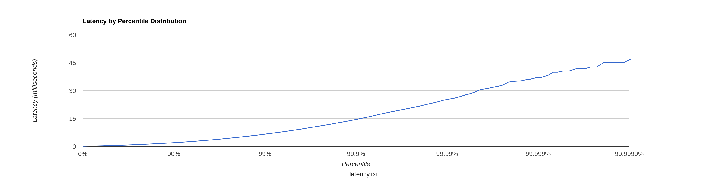

# latency-test

Sample project for experimenting with different performance and parallelism configurations. 

## Samples

### Usage

Build the project:

```mvn clean install```

Run one of the chosen sample topologies. Maven places the compiled jar into `target/` by default.

```storm jar latency-test*.jar org.apache.storm.flux.Flux <topology.yaml> --[remote|local]```

#### outliers.yaml

Creates a topology that has occasional tuples which take much longer than most. The distribution will look something like:



#### consistent.yaml

Creates a topology with, you guessed it, consistent latency. In the default case, 100ms. 

